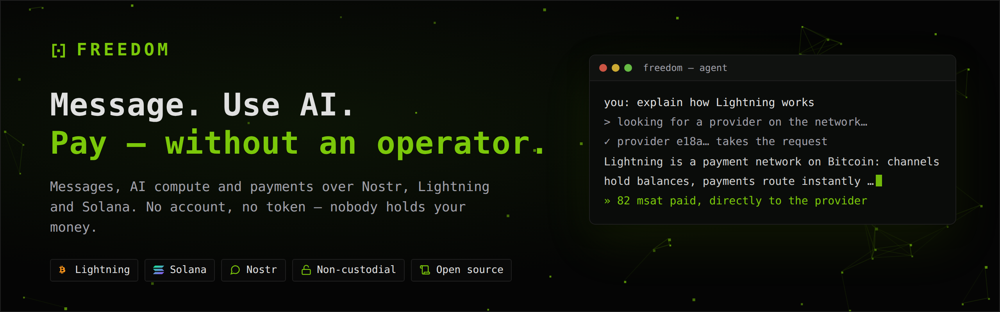

<p align="center"></p>

# FreedomStack

Nachrichten, Zahlungen und KI-Anfragen ohne Betreiber: Kommunikation über
Nostr, Bezahlung über Lightning (sats) und Solana (SOL), KI-Aufträge, die
Provider gegen Bezahlung ausführen (NIP-90). Niemand verwahrt Geld, niemand
kann das Netz allein abschalten.

- **App:** https://3dagi.github.io/freedom-app/freedom.html – eine einzige
  HTML-Datei; die Prüfsumme steht daneben (`freedom.html.sha256`) und entsteht
  bitgleich aus jedem frischen Checkout (`scripts/repro-build.sh --pruefen`).
- **Website, Whitepaper, FAQ:** https://3dagi.github.io/freedom-app/

## Aufbau

| Ort | Inhalt |
|---|---|
| `packages/app` | Web-App: Agent/KI, Kommunikation (Direktnachrichten, Räume), Währung (Wallets, Swaps, Zahlkanal), Earn, Profil, Settings; Build → `dist/freedom.html` |
| `packages/protocol` | Protokollbausteine: Nostr, NIP-44/NIP-17/NIP-59, DVM, HTLC, Zahlkanal, Gebühren, Mesh, Nachfolge, Zeitanker u. v. m. |
| `packages/node` | Provider-Knoten: KI-Aufträge, Abrechnung, Liquidität für Swaps, Relay-, Speicher- und Gateway-Rolle |
| `packages/mls` | MLS (Marmot/MDK) als WebAssembly – Gruppen- und 1:1-Verschlüsselung mit Vorwärtsgeheimnis |
| `packages/website` | Startseite, Whitepaper, FAQ, Roadmap, Status-Seite |
| `packages/launcher` | Die App als eigenes Programm für Linux, Windows und Android (Tauri 2), auf Wunsch über Tor – Vorschau zum Herunterladen über die Releases (Linux x64/arm64, Windows; Android mit festem Schlüssel) |
| `contracts/solana-htlc` | Hash-Zeitschloss für Swaps Lightning ↔ SOL (Devnet) |
| `contracts/solana-channel` | Zahlkanal für SOL (`docs/ZAHLKANAL.md`) |
| `docs/` | Protokoll (`PROTOCOL.md`), Ausbauplan (`ausbau/`), Entscheidungen (`neuordnung/SAMMLUNG.md`) |

## Provider werden

```bash
bash <(curl -fsSL https://3dagi.github.io/freedom-app/install.sh)   # fragt die Lightning-Adresse ab
# oder aus einem geprüften Checkout:
bash scripts/install-freedom.sh
# oder ohne Systemänderung, mit deiner eigenen Lightning-Adresse:
NODE_LUD16=provider@knoten.example.org REGION=eu docker compose up -d
```

Ohne Lightning-Adresse startet der Knoten nicht. Am besten liegt sie beim
eigenen Knoten statt bei einem verwahrenden Dienst – Anleitung, SOL-Auszahlung
und Prüfung (`npm run pruefen`) in `docs/PROVIDER.md`.

## Gebühren

Jeder Anteil geht beim Zahlen direkt an seinen Empfänger – kein Topf, keine
Auszahlung durch Dritte. Feste Anteile (`packages/protocol/src/aufteilung.ts`,
CI-Invariante):

| Anteil | Empfänger | Fehlt der Empfänger |
|---|---|---|
| 94 % | Provider | – |
| 2 % | Entwicklung (selbstverwahrte Adressen) | an den Provider |
| 0,5 % | Prüfbudget – bleibt beim Kunden und bezahlt seine Prüfrunden | an den Provider |
| 1,5 % | Relays, über die der Auftrag lief (höchstens drei) | an den Provider |
| 0,5 % | Werber des Kunden | an den Provider |
| 0,5 % | Werber des Providers | an den Provider |
| 1 % | Hosting: der Spiegel, von dem die App geladen wurde | an den Provider |

## Grundsätze

1. **Nicht verwahrend.** Das Protokoll hält nie fremdes Geld; Rundungsreste und
   Anteile ohne Empfänger gehen an den Provider, nie an die Entwicklung.
2. **Kein eigener Token.** Bezahlt wird in sats und SOL, beide gleichwertig.
3. **Tausch statt Brücke.** Swaps mit Hash-Zeitschloss tauschen native Werte;
   Lightning endet immer vor Solana (`docs/SWAPS.md`).
4. **Neue Funktionen als Nostr-Events**, nicht als zentraler Dienst.
5. **Mehrere Relays**, nie eines allein; die Startliste ist nur der Einstieg,
   danach gelten die eigenen Listen (NIP-65).
6. **Ende-zu-Ende verschlüsselt** – und ehrlich, wo es aufhört: Der Provider
   liest den Prompt, Blockchain-Einträge bleiben öffentlich, die IP schützt nur
   Tor. Der Datenschutzbericht der App sagt nur, was der Code belegt.
7. **Unveränderlich erst nach Prüfung.** Die Solana-Programme haben heute noch
   Upgrade-Rechte; sie fallen erst nach Audit und langer Testphase weg
   (`docs/SOLANA-UPGRADE-AUTHORITY.md`).

## Entwickeln

```bash
npm ci
cd packages/protocol && npx tsc -p tsconfig.json --noEmit && npm test
cd packages/node     && npx tsc -p tsconfig.json --noEmit && npm test
cd packages/app      && npx tsc -p tsconfig.json --noEmit && npm test && npm run test:leak && node build.mjs
python3 scripts/smoke_test.py packages/app/dist   # Browser-Test (Playwright, Chromium)
```

Alle Befehle und Regeln stehen in `CLAUDE.md`, die Fallstricke dort und je Bereich in
`packages/*/CLAUDE.md`, `contracts/CLAUDE.md` und `scripts/CLAUDE.md`, der Ausbauplan in
`docs/ausbau/` (`FORTSCHRITT.md`), das Protokoll jedes Schritts in `STATUS.md`.
Veröffentlicht wird nur über `.github/workflows/pages.yml` und nur mit grünen
Tests.

## Stand

Auf Devnet und mit Test-Wallets erprobt; echtes Geld über echte Infrastruktur
ist noch nicht geflossen. Was vor dem Start fehlt, steht in `GO-LIVE.md`, was
nur ein Mensch erledigen kann (Schlüssel, Konten, Deploy), in `docs/KONTEN.md`
und `docs/neuordnung/SAMMLUNG.md` (Abschnitt 6).

## Lizenz

Copyright © 2026 3DAGI und die Mitwirkenden. Licensed under the EUPL.

FreedomStack steht unter der **European Union Public Licence v. 1.2**
(EUPL-1.2), Wortlaut in [`LICENSE`](LICENSE). In Kürze:

- **Copyleft, auch über das Netz:** Wer eine geänderte Fassung weitergibt oder
  ihre wesentlichen Funktionen über das Netz anbietet (etwa einen geänderten
  Knoten), legt den Quellcode offen (Art. 1, 5).
- **Namen und Marken** des Lizenzgebers sind nicht lizenziert (Art. 5).
- **Recht und Gericht:** Es gilt das Recht des EU-Staats, in dem der
  Lizenzgeber seinen Sitz hat; zuständig ist ausschließlich das Gericht dort, wo
  er wohnt oder hauptsächlich tätig ist (Art. 14, 15).
- **Sprachen:** Die EUPL gibt es amtlich in allen Amtssprachen der EU, auch auf
  Deutsch; alle Fassungen gelten gleich (Art. 13):
  https://joinup.ec.europa.eu/collection/eupl/eupl-text-eupl-12
- **Verträgliche Lizenzen** (Anhang der EUPL): Wird FreedomStack mit Code unter
  einer davon zu einem abgeleiteten Werk verbunden, darf dieses auch unter jener
  Lizenz weitergegeben werden (Art. 5).

## Rechtlicher Hinweis

Technisches Referenzprojekt, keine Rechts- oder Anlageberatung. Der Betrieb
einzelner Komponenten kann regulatorische Pflichten auslösen (MiCA/AMLR).
